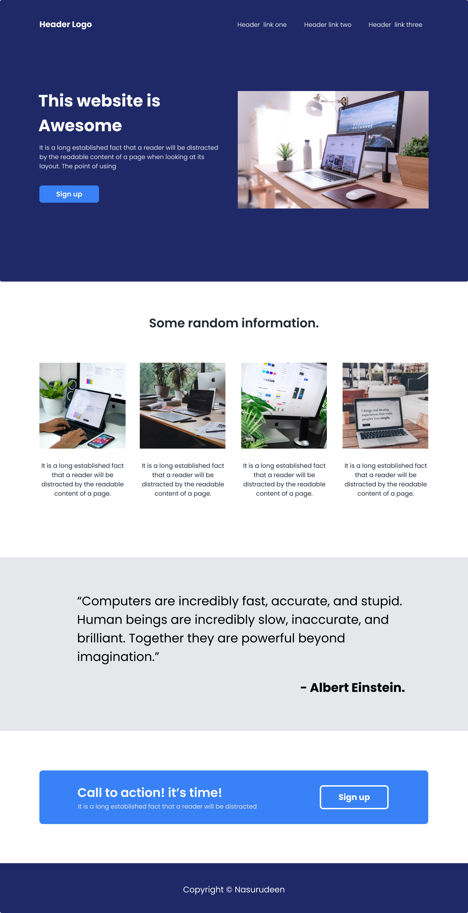

# Odin-landing-page

This is my code for the Landing Page project in The Odin Project Foundations course.

[**Live preview**](https://nazruweb.github.io/Odin-landing-page/)

---

## Project Details

The Odin Project provided a webpage design that I needed to clone using HTML and CSS for the desktop. They also provided a style guide for colors and font sizes. The point of this assignment is to create something from scratch and getting various elements in more or less the right position relative to the rest.

## Skills Learned

- Coming more comfortable with the CSS Flexbox model, especially justify-content and align-item rules
- Continuing to practice Git and Github project management
- Taking someone else's design and using HTML/CSS to make it happen
- Working on a project over multiple days and focusing on certain sections only

